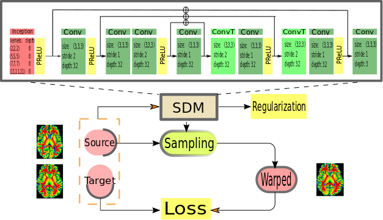
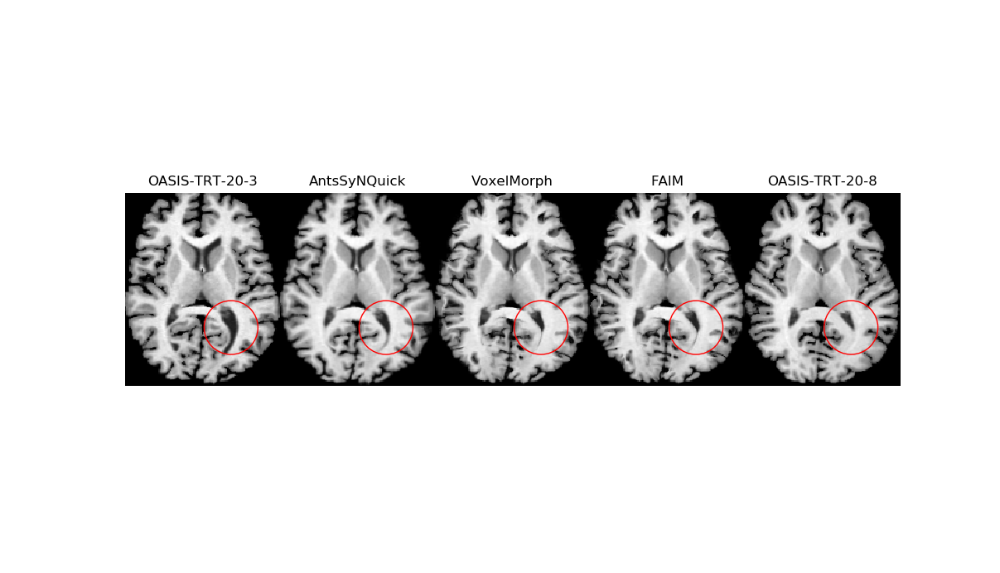
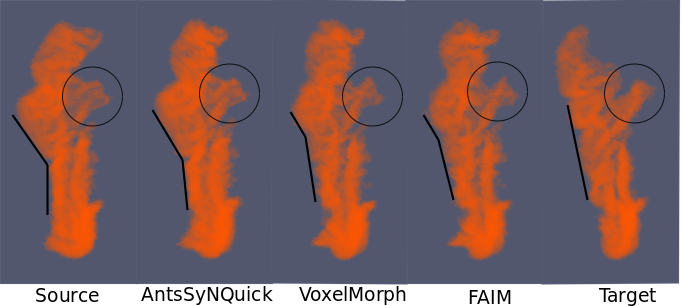
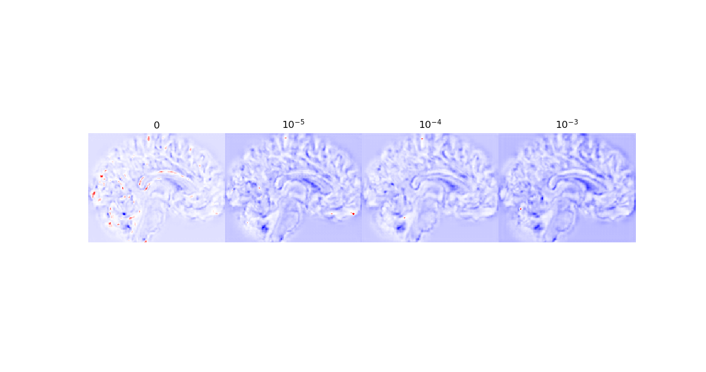
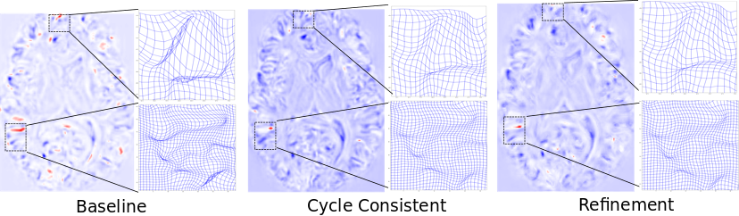

# Medical-image-registration
It is a project for developing registration tools with neural networks, applicable to other image registration tasks. Code is written using `Keras` with `Tensorflow` backend. `SimpleITK` is used to read from and write to ``.nii`` or other medical image formats. All data contained in this repository is in `.npy` format. The code here is directly applicable to grey level images. For RGB images, one should modify the codes accordingly. Input should be of format `(batchsize, height, width, channel)` in 2D cases and `(batchsize, height, width, depth, channel)` in 3D cases. In both cases, the first channel will store the source image, the target image is stacked to the second channel.

Feel free to check https://arxiv.org/abs/1811.09243 for more details. The project is still ongoing, more details will be released.
### An overview
The following figure is an overview of the network's work flow:

A comparison with other methods:

Deforming source image to target image:

Deforming source label to target label: 

"Foldings", i.e locations where the transformation has negative Jacobian determinants in predicted deformation can be addressed either by using a hard constraint penalizaing negative Jacobian determinants in the loss function or a soft constraint by different training mechanism without changing the configuration of baseline registration network.

Effect of penalizaing negative Jacobian determinants in the predicted deformation (folding locations shown in red):

Effect of using cycle consistent design and refinement module on the baseline network.

### Preprocess
It is assumed that source and target are already roughly linearly aligned. Each image volume is normalized by its maximum intensity.

### Source
* `architecture.py`: contains some network architectures for learning the proper displacement field.
* `losses.py`: contains some losses/regularization functions.
* `spatial_deformer_net.py`: a module taking learned displacement field to warp input images in 2D.
* `spatial_transformer_net.py`: a module taking learned affine transformation to warp input images in 2D.
* `spatial_deformer_net3d.py`: a module taking learned displacement field to warp input images in 3D.
* `spatial_transformer_net3d.py`: a module taking learned affine transformation to warp input images in 3D.
* `Utils.py`: Contains some utility functions.
* `visual.py`: Contains some functions for visualization.
* `view_dice.py`: Contains some functions that make summary plots when comparing dice score from different methods.
* `train.py`: Main script training the network.
* `train_MB_invcomp.py`: Train the network with a cycle consistent design.
* `train_refine_alt.py`: Alternative training with a refinement module for refining the displacement field. 
* `eval.py`: Eval the trained model on test data in terms of dice score.
* `pred_samples.py`: Used to generate samples from prediction.
* `Gen_temp.py`: Used to generate average image and produce probability labels when constructing atlas.

### Output
Contains generated label probabilities and a volume of winning labels with `Gen_temp.py` on [LPBA40 data set](http://resource.loni.usc.edu/resources/atlases-downloads/) and also on `OASIS-TRT-20` dataset used in [MindBoggle101](https://mindboggle.info/data)
